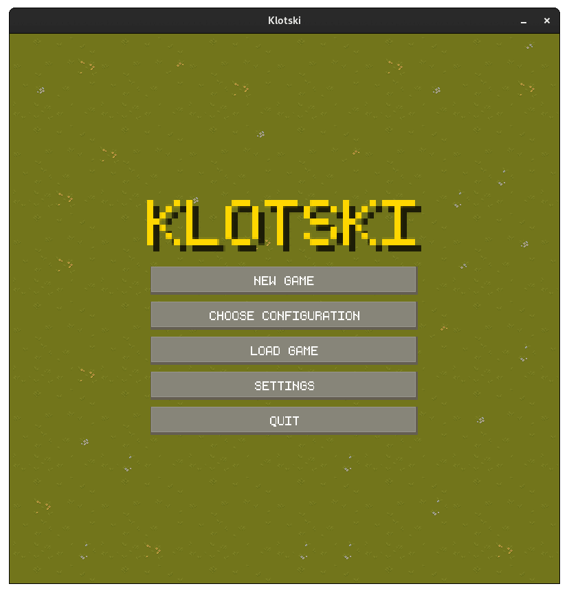

# Klotski

Welcome to the Klotski game! Klotski is a sliding block puzzle game where the goal is to move the special block (also
known as the "hero" block) to a specific location on the game board by sliding the other blocks out of the way.

## Demo



## Documentation

[Documentation](https://birsax2.github.io/klotski/)

## Installation

Clone this repository

```bash
  git clone https://github.com/BIRSAx2/klotski
  cd klotski
  ./gradlew desktop:run
```

Mote: make sure you have Java 17 or higher installed on your system, and Android SDK to project.

## Running Tests

To run tests, run the following command

```bash
  ./gradlew core:test
```

## Acknowledgements

- [LibGDX](https://libgdx.com/)

## Authors

- [@BIRSAx2](https://www.github.com/BIRSAx2)
- [@gp-9](https://www.github.com/gp-9)

## License

[MIT](https://choosealicense.com/licenses/mit/)

