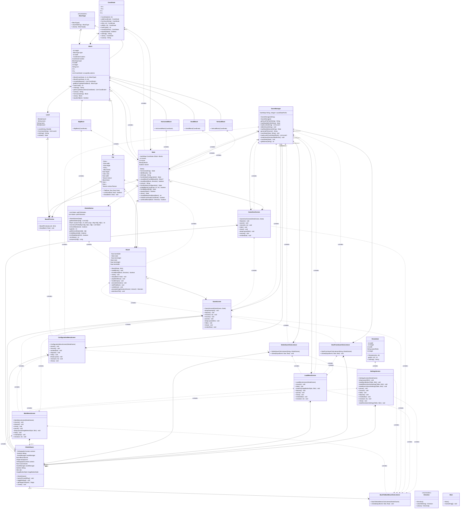

```mermaid
classDiagram
    direction BT
    class BackToMainMenuClickListener {
        + BackToMainMenuClickListener(KlotskiGame)
        + clicked(InputEvent, float, float) void
    }
    class BigBlock {
        + BigBlock(Coordinate)
    }
    class Block {
        + Block(Coordinate, int, int, BlockType)
        + Block(Coordinate, int, int)
        - int height
        - BlockType type
        - int width
        - Coordinate location
        + occupiedSpaces() List~Coordinate~
        - getBlockTypeBySize(Block) BlockType
        + hashCode() int
        + toString() String
        + getOccupiedLocations(Coordinate) List~Coordinate~
        + toJson() String
        + fromJson(String) Block
        + clone() Block
        + equals(Object) boolean
        Coordinate location
        BlockType type
        int width
        int height
        String icon
        int x
        int y
        List~Coordinate~ occupiedLocations
    }
    class BlockType {
        <<enumeration>>
        + BlockType()
        + valueOf(String) BlockType
        + values() BlockType[]
    }
    class Board {
        + Board(State, Skin)
        - float itemWidth
        - State state
        - float itemHeight
        + loadBlocks() void
        - moveBlock(Block, Direction) boolean
        + reset() void
        + draw(Batch, float) void
        + playBestMove() void
        + handleInput() void
        - calculateSolution() void
        + addTile(Block) void
        + undoMove() void
        - calculateDragDirection(Vector2, Vector2) Direction
        - selectNextTile() void
        State state
        float itemHeight
        float itemWidth
    }
    class BoardPreview {
        + BoardPreview(Level, Skin)
        + draw(Batch, float) void
    }
    class ConfigurationMenuScreen {
        + ConfigurationMenuScreen(KlotskiGame)
        + pause() void
        + resume() void
        + render(float) void
        + dispose() void
        + hide() void
        - setupLayout() void
        + resize(int, int) void
        + show() void
    }
    class Coordinate {
        + Coordinate(int, int)
        - int x
        - int y
        + add(Coordinate) Coordinate
        + fromJson(String) Coordinate
        + of(int, int) Coordinate
        + add(int, int) Coordinate
        + hashCode() int
        + move(Direction) Coordinate
        + equals(Object) boolean
        + toString() String
        + clone() Coordinate
        + toJson() String
        int x
        int y
    }
    class DeleteSaveClickListener {
        + DeleteSaveClickListener(String, KlotskiGame)
        + clicked(InputEvent, float, float) void
    }
class Direction {
<<enumeration>>
+ Direction()
+ valueOf(String) Direction
+ values() Direction[]
}
class GameOverScreen {
+ GameOverScreen(KlotskiGame, State)
+ dispose() void
+ pause() void
+ resize(int, int) void
+ hide() void
+ show() void
- setupLayout(Skin) void
+ resume() void
+ render(float) void
}
class GameScreen {
+ GameScreen(KlotskiGame, State)
- setupSaveInput() void
+ dispose() void
+ resize(int, int) void
+ resume() void
+ pause() void
- setupLayout(Skin) void
+ hide() void
+ show() void
+ render(float) void
}
class HorizontalBlock {
+ HorizontalBlock(Coordinate)
}
class KlotskiGame {
+ KlotskiGame()
- OrthographicCamera camera
- boolean debug
- AssetManager assetManager
+ buttonPressedPlay() void
+ toggleDebug() void
+ getStage(Viewport) Stage
+ create() void
float effectsVolume
Image background
OrthographicCamera camera
float musicVolume
AssetManager assetManager
boolean debug
Skin skin
ImageButtonStyle imageButtonStyle
}
class KlotskiSolver {
+ KlotskiSolver(State)
- List~State~ pathToSolution
- getNextStates(int[]) List~int[]~
- bfs(int, Queue~int[]~, int, Set~Long~, Map~int[], int[]~) int
- reconstructPath(Map~int[], int[]~, int[]) List~State~
- isOnLeftBorder(int) boolean
- log2(int) int
- getMirroredState(int[]) int[]
- isValidBoard(int[]) boolean
- isOnRightBorder(int) boolean
+ minSteps() int
- compress(int[]) Long
List~State~ pathToSolution
}
class Level {
+ Level(String, Block[])
- Block[] board
- String name
+ fromJson(String) List~Level~
+ toString() String
+ toState() State
String name
Block[] board
}
class LoadMenuScreen {
+ LoadMenuScreen(KlotskiGame)
+ resume() void
+ hide() void
- createUI(ImageButtonStyle, Skin) void
+ dispose() void
+ pause() void
+ show() void
+ render(float) void
+ resize(int, int) void
}
class Main {
+ Main()
+ main(String[]) void
}
class MainMenuScreen {
+ MainMenuScreen(KlotskiGame)
+ resume() void
+ dispose() void
+ show() void
+ pause() void
- setupLayout(ImageButtonStyle, Skin) void
+ hide() void
+ render(float) void
+ resize(int, int) void
}
class Resolution {
+ Resolution(int, int)
- int width
- int height
- gcd(int, int) int
+ toString() String
int width
String aspectRatio
int height
}
class SavesManager {
+ SavesManager(String)
+ SavesManager()
- getSaveFilePath(String) String
+ loadStateByPath(String) State
+ loadLevels(String) List~Level~
+ deleteSave(String) void
+ loadStateByName(String) State
- generateFilename() String
+ saveState(State, String) void
+ loadLevelsFromDefaultPath() List~Level~
- createSaveDirectoryIfNotExists() void
+ saveState(State) void
+ getMoves(String) int
HashMap~String, Integer~ savedStatePaths
}
class SettingsScreen {
+ SettingsScreen(KlotskiGame)
- setupLayout(Skin) void
- makeBackButton(Table, Skin) void
- makeEffectsVolumeSettings(Table, Skin) void
- makeMusicVolumeSettings(Table, Skin) void
+ pause() void
+ resume() void
+ hide() void
+ dispose() void
+ render(float) void
+ resize(int, int) void
+ show() void
- makeResolutionSettings(Table, Skin) void
}
class SmallBlock {
+ SmallBlock(Coordinate)
}
class StartFromSaveClickListener {
+ StartFromSaveClickListener(String, KlotskiGame)
+ clicked(InputEvent, float, float) void
}
class State {
- State()
- HashMap~Coordinate, Block~ blocks
- int moves
+ fromJson(String) State
+ toBitBoard() int[]
+ toString() String
+ fromDefaultConfiguration() State
+ createBlockFromBitMask(int) Block?
+ moveBlock(Block, Direction) boolean
+ toJson() String
+ fromRandomConfiguration() State
- isValidBlock(Coordinate, int, int) boolean
+ fromBitBoard(int[]) State
+ equals(Object) boolean
+ clone() State
+ createBitMaskForBlock(Block) int
+ isValidCoordinate(Coordinate) boolean
+ canMoveBlock(Block, Direction) boolean
int moves
Block[] blocks
boolean solved
}
class Tile {
+ Tile(float, float, float, float)
- float x
- float width
- float height
- float y
- Block block
+ contains(float, float) boolean
+ draw(Batch, float) void
float height
Color color
float width
Texture texture
Block block
float x
float y
Texture contourTexture
}
class VerticalBlock {
+ VerticalBlock(Coordinate)
}

BackToMainMenuClickListener "1" *--> "game 1" KlotskiGame
BackToMainMenuClickListener  ..>  MainMenuScreen : «create»
BigBlock  -->  Block
Block "1" *--> "type 1" BlockType
Block "1" *--> "location 1" Coordinate
Block  -->  BlockType
Board  ..>  KlotskiSolver : «create»
Board "1" *--> "solution *" State
Board "1" *--> "tiles *" Tile
Board  ..>  Tile : «create»
BoardPreview "1" *--> "level 1" Level
BoardPreview "1" *--> "state 1" State
BoardPreview "1" *--> "tiles *" Tile
ConfigurationMenuScreen  ..>  BackToMainMenuClickListener : «create»
ConfigurationMenuScreen  ..>  BoardPreview : «create»
ConfigurationMenuScreen  ..>  GameScreen : «create»
ConfigurationMenuScreen "1" *--> "game 1" KlotskiGame
ConfigurationMenuScreen  ..>  SavesManager : «create»
ConfigurationMenuScreen "1" *--> "savesManager 1" SavesManager
DeleteSaveClickListener "1" *--> "game 1" KlotskiGame
DeleteSaveClickListener  ..>  LoadMenuScreen : «create»
DeleteSaveClickListener  ..>  SavesManager : «create»
DeleteSaveClickListener "1" *--> "savesManager 1" SavesManager
GameOverScreen  ..>  BackToMainMenuClickListener : «create»
GameOverScreen "1" *--> "game 1" KlotskiGame
GameOverScreen "1" *--> "savesManager 1" SavesManager
GameOverScreen  ..>  SavesManager : «create»
GameOverScreen "1" *--> "state 1" State
GameScreen  ..>  BackToMainMenuClickListener : «create»
GameScreen  ..>  Board : «create»
GameScreen "1" *--> "grid 1" Board
GameScreen  ..>  GameOverScreen : «create»
GameScreen "1" *--> "game 1" KlotskiGame
GameScreen  ..>  MainMenuScreen : «create»
GameScreen  ..>  SavesManager : «create»
GameScreen "1" *--> "savesManager 1" SavesManager
HorizontalBlock  -->  Block
KlotskiGame  ..>  MainMenuScreen : «create»
KlotskiSolver  ..>  BigBlock : «create»
KlotskiSolver "1" *--> "pathToSolution *" State
Level "1" *--> "board *" Block
LoadMenuScreen  ..>  BackToMainMenuClickListener : «create»
LoadMenuScreen  ..>  DeleteSaveClickListener : «create»
LoadMenuScreen "1" *--> "game 1" KlotskiGame
LoadMenuScreen "1" *--> "savesManager 1" SavesManager
LoadMenuScreen  ..>  SavesManager : «create»
LoadMenuScreen  ..>  StartFromSaveClickListener : «create»
MainMenuScreen  ..>  ConfigurationMenuScreen : «create»
MainMenuScreen  ..>  GameScreen : «create»
MainMenuScreen "1" *--> "game 1" KlotskiGame
MainMenuScreen  ..>  LoadMenuScreen : «create»
MainMenuScreen  ..>  SettingsScreen : «create»
SettingsScreen  ..>  BackToMainMenuClickListener : «create»
SettingsScreen "1" *--> "game 1" KlotskiGame
SettingsScreen  ..>  Resolution : «create»
SmallBlock  -->  Block
StartFromSaveClickListener  ..>  GameScreen : «create»
StartFromSaveClickListener "1" *--> "game 1" KlotskiGame
StartFromSaveClickListener  ..>  SavesManager : «create»
StartFromSaveClickListener "1" *--> "savesManager 1" SavesManager
State  ..>  BigBlock : «create»
State "1" *--> "blocks *" Block
State  ..>  Block : «create»
State  ..>  Coordinate : «create»
State "1" *--> "blocks *" Coordinate
State  ..>  HorizontalBlock : «create»
State  ..>  SavesManager : «create»
State "1" *--> "savesManager 1" SavesManager
State  ..>  SmallBlock : «create»
State  ..>  VerticalBlock : «create»
Tile "1" *--> "block 1" Block
VerticalBlock  -->  Block

```
