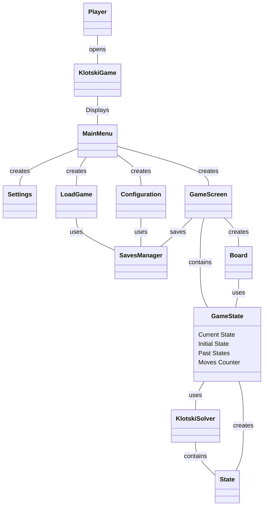

## Domain Model Diagram
Let's briefly discuss the domain model. Observing the diagram it's possible to distinguish every use case. There is a "SETTINGS" screen which will allow the user to change the resolution and the volume as he prefers. It is possible to "LOAD", "SAVE" and choose a configuration of the puzzle through the SavesManager. The GameScreen provides the interface to interact with the puzzle: through the GameState it is possible to "MOVE" a block, "UNDO" an action, get the "NEXT BEST ACTION" using KlotskiSolver, "RESTART" the puzzle from the beginning and visualize the "MOVES COUNTER".

