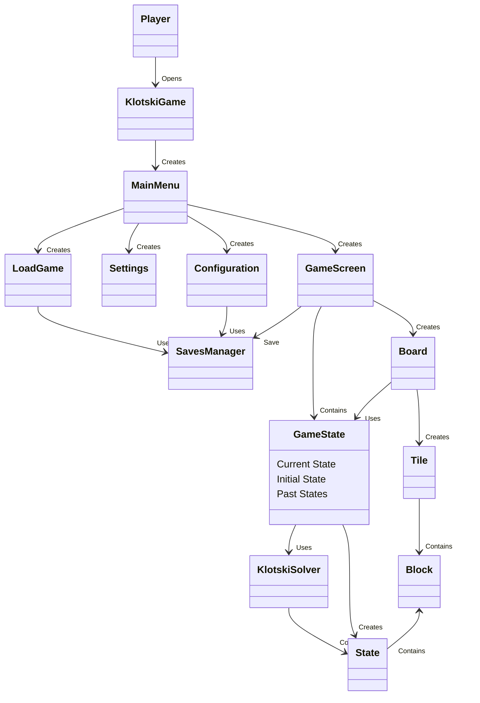

Domain Model

```mermaid
classDiagram
    
    Player --> "Opens" KlotskiGame
    
    KlotskiGame --> "Creates" MainMenu
    
    MainMenu --> "Creates" GameScreen
    MainMenu --> "Creates" Settings
    
    
    MainMenu --> "Creates" LoadGame
        
    LoadGame --> "Uses" SavesManager
    
    MainMenu --> "Creates" Configuration
    Configuration --> "Uses" SavesManager
    
    
    GameScreen --> "Creates" Board
    GameScreen --> "Contains" GameState
    GameScreen --> "Save " SavesManager
    
    GameState: Current State
    GameState: Initial State
    GameState: Past States
    
    GameState --> "Uses" KlotskiSolver
    
    KlotskiSolver --> "Contains" State
    
    GameState --> "Creates" State
    
    Board --> "Creates" Tile
    
    Board --> "Uses" GameState
    
    Tile --> "Contains" Block
    
    Block <-- "Contains" State
    
    
    
    
```
