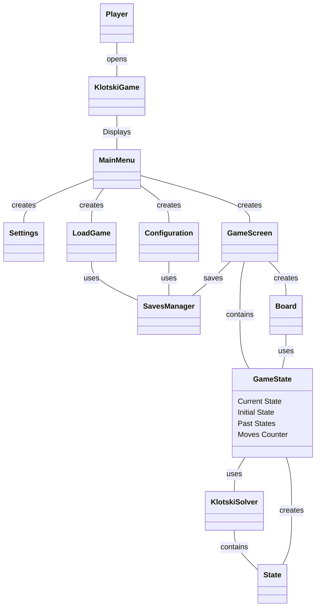

## Domain Model Diagram
Let's briefly discuss the domain model. Observing the diagram it's possible to distinguish every use case. When the player opens the Klotski game the main menu displays giving to the player the possibility to open "SETTINGS", to "LOAD" a game, to choose a "CONFIGURATION" or to start a "NEW" game. Then, when the game starts, through the GameState it is possible to "RESET" the game using the initial state, to "UNDO" a move, using the past states and asking for a hint using the Klotski Solver algorithm ("NEXT BEST MOVE"). Eventually it is possible to "SAVE" the game through the Saves Manager.

