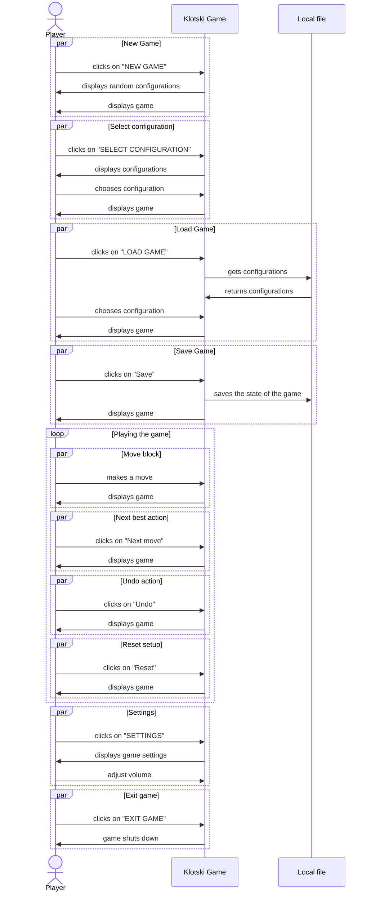
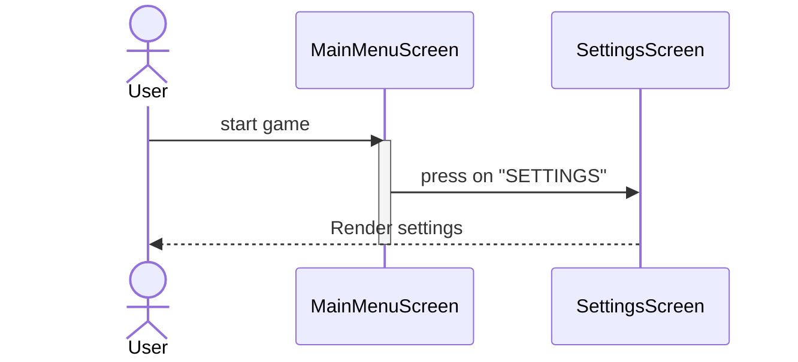
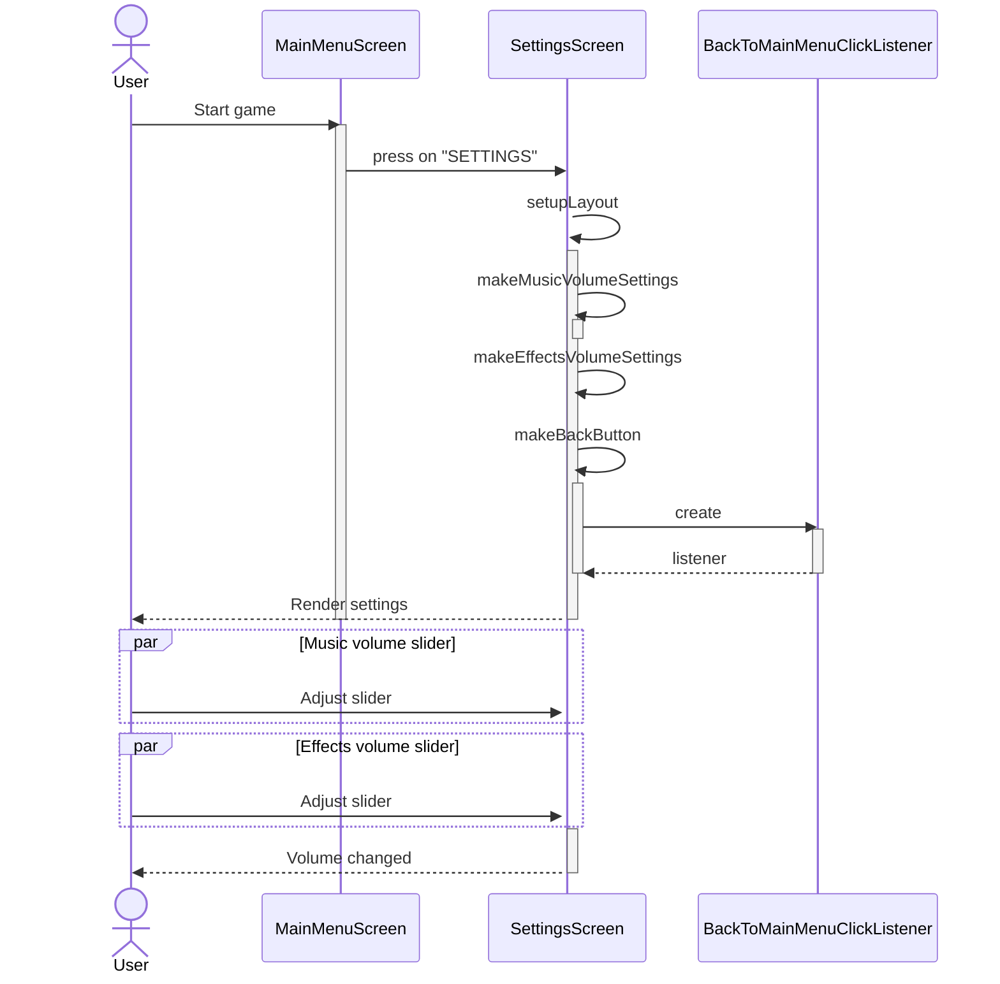
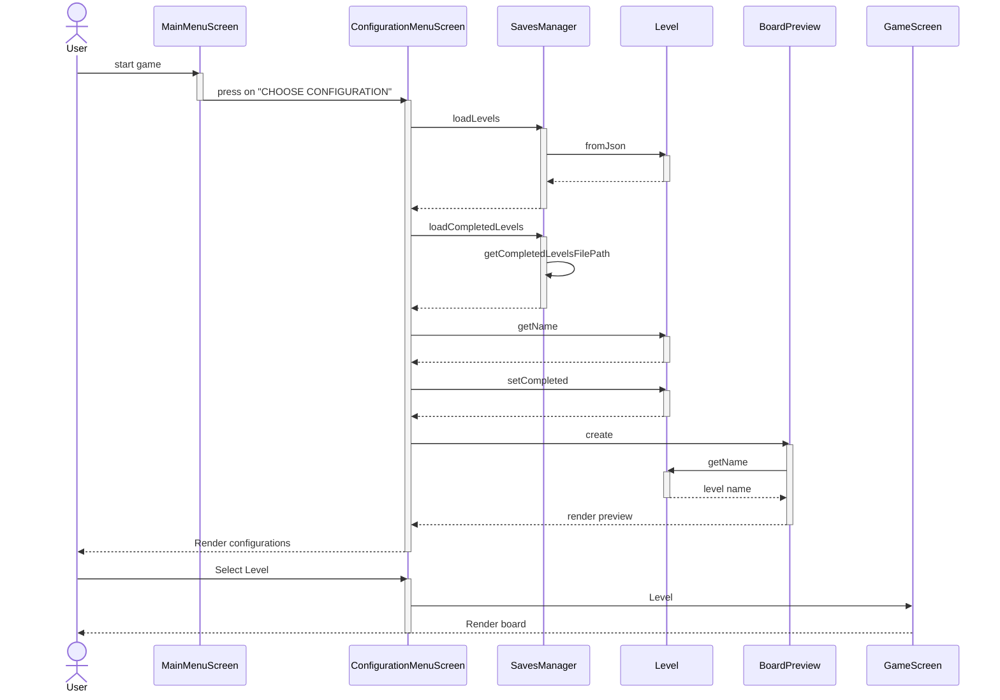
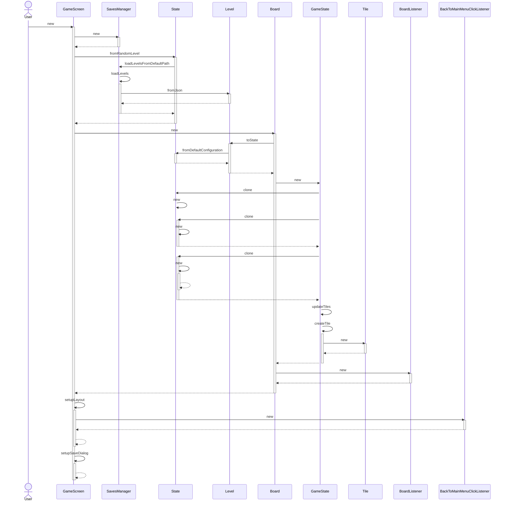
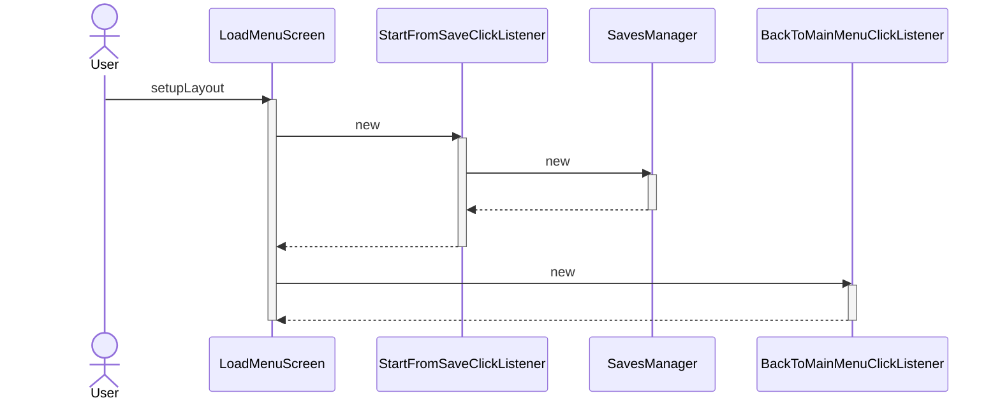
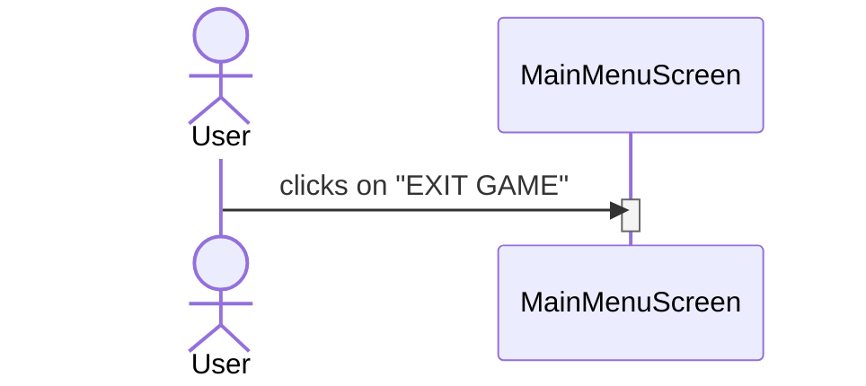

# System Sequence Diagram

[//]: # (Reference: https://mermaid.js.org/syntax/sequenceDiagram.html)

# Internal Sequence Diagram

### Game Settings

### Adjust Music/Effects Volume

### Select Starting Configuration

### New Game

### Load Game

### Exit Game

