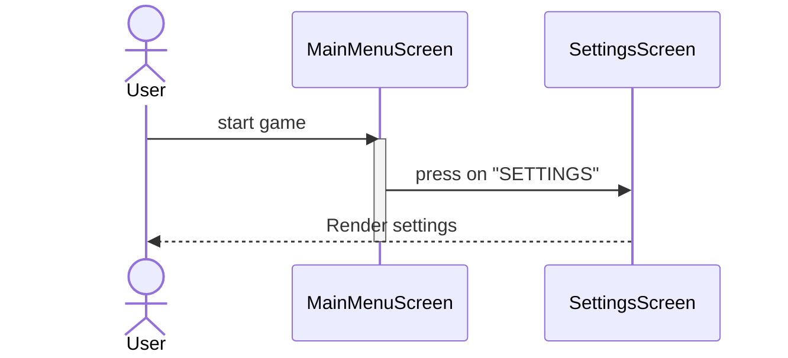
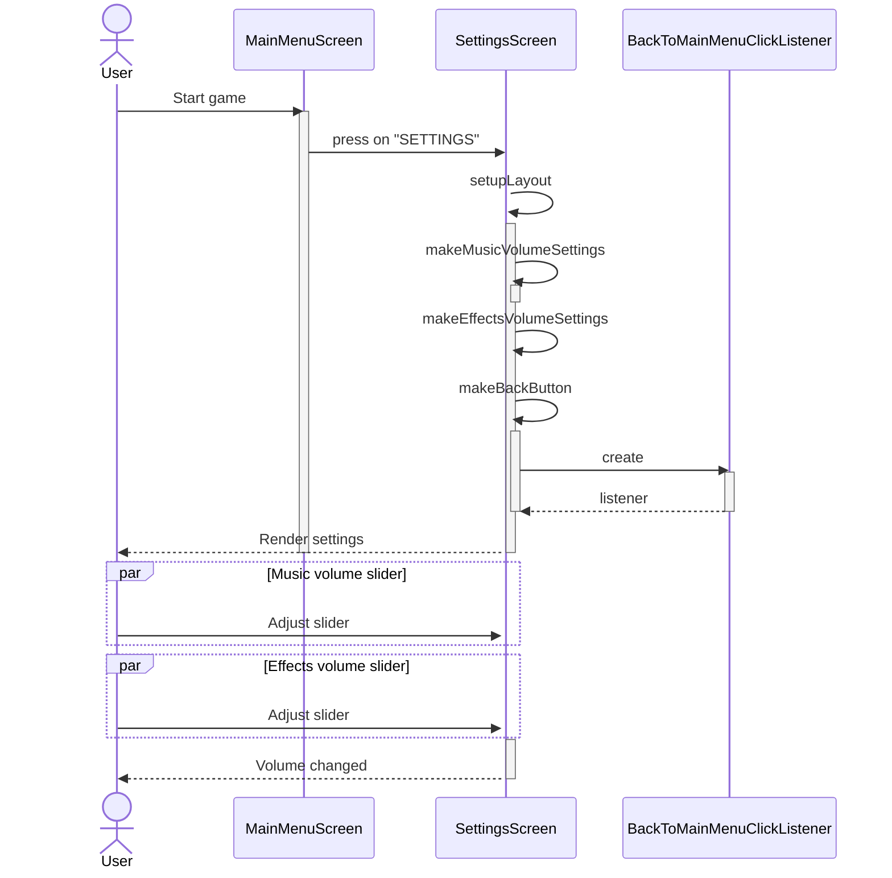
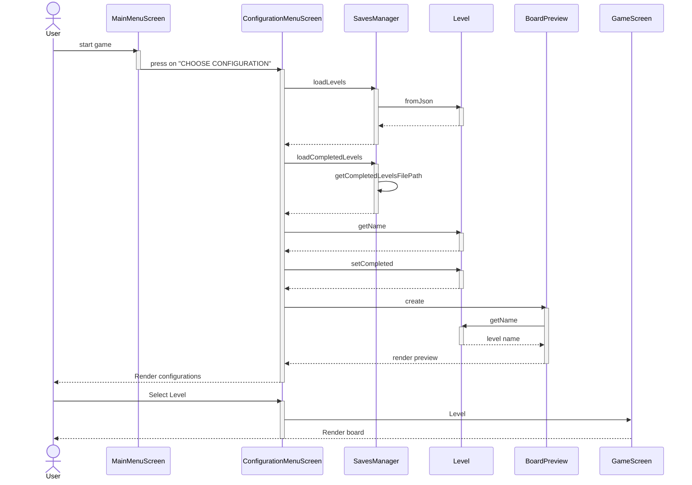
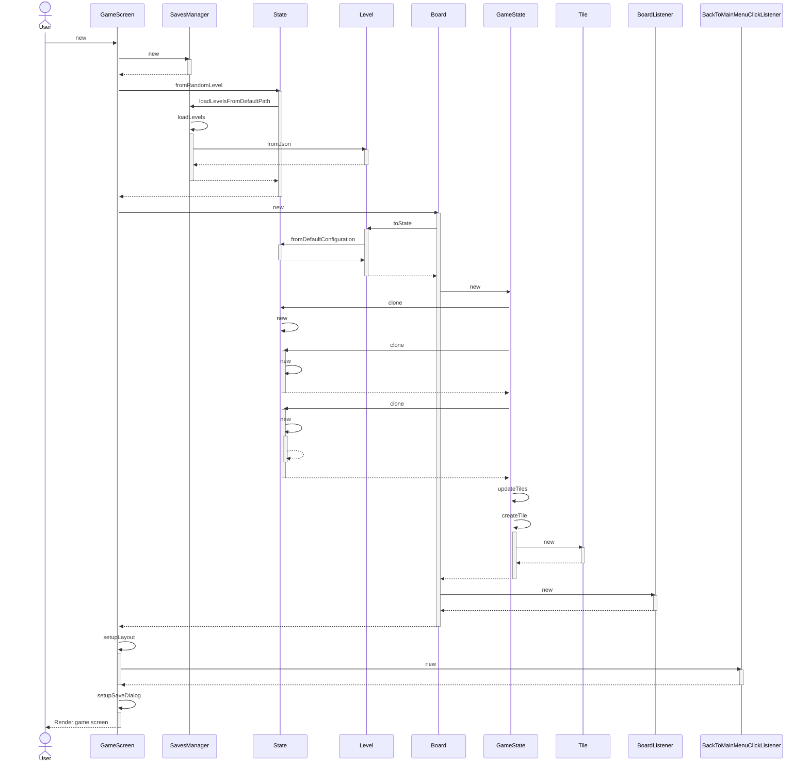
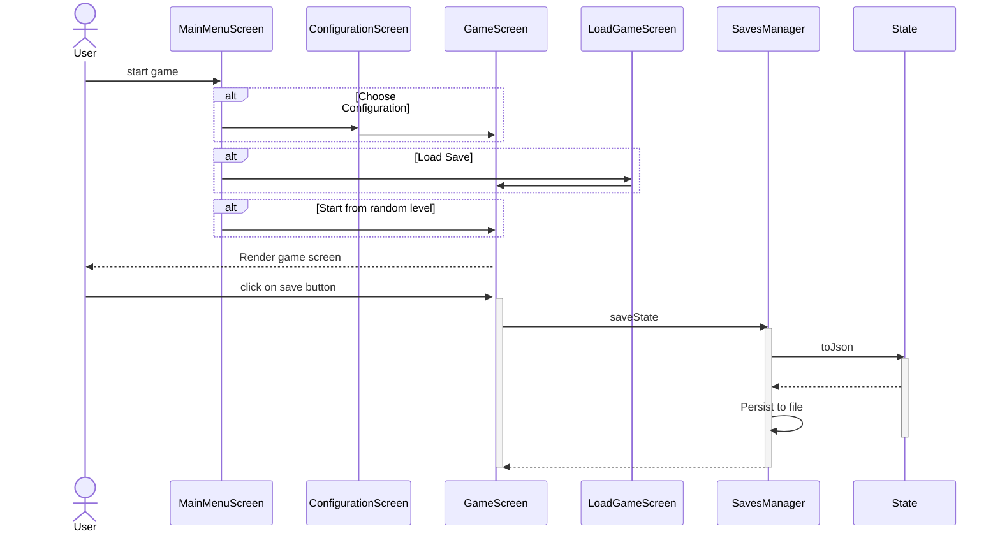
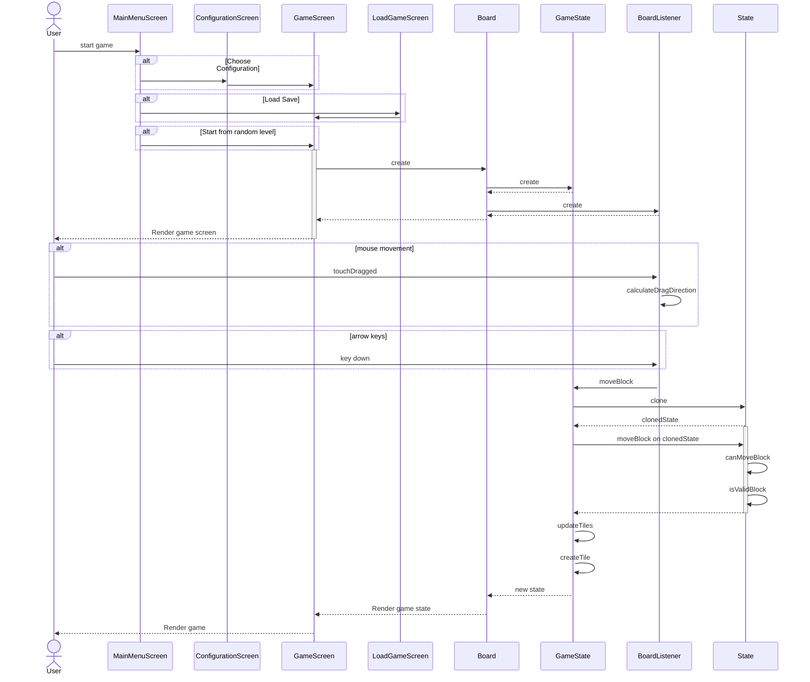

# System Sequence Diagram

[//]: # (Reference: https://mermaid.js.org/syntax/sequenceDiagram.html)

# Internal Sequence Diagram

### Game Settings

### Adjust Music/Effects Volume

### Select Starting Configuration

## New Game

## Load Game

Trigolo

## Exit Game
Trigolo

## Save Game

## Move Blocks
# Incompleto

## Next Best Action
Mouhi
## Undo Action
Gianluca
## Reset game
Gianluca
## Moves Counter
Gianluca
