# Sequence diagram
In this page it is possible to find the system sequence diagram and the internal sequence diagram for every use case.

### Settings
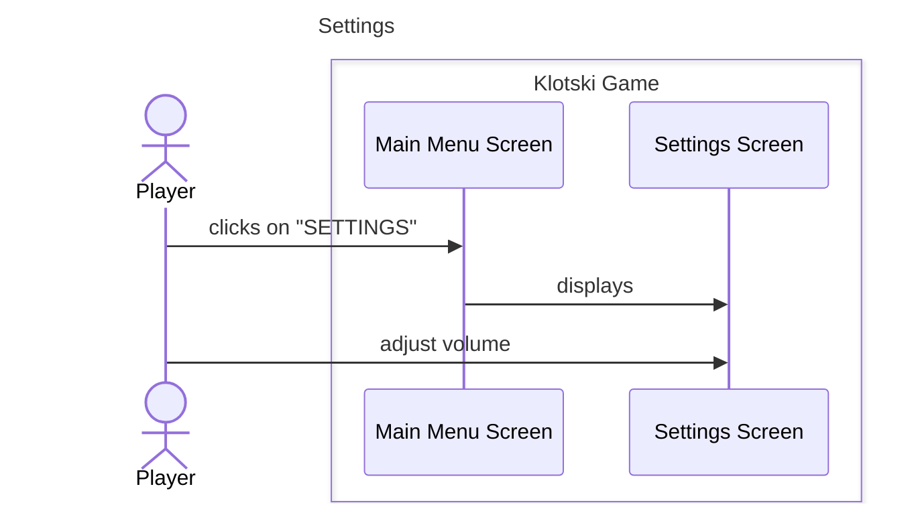

### Select configuration
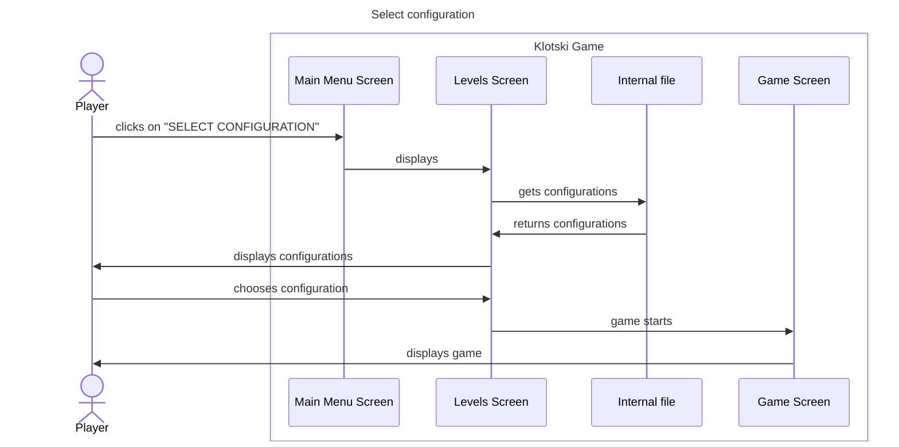

### New game
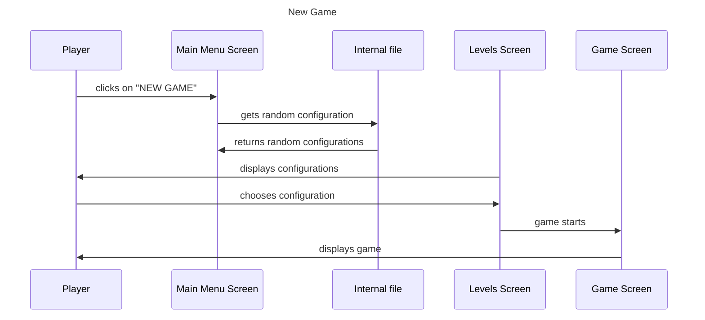

### Load Game
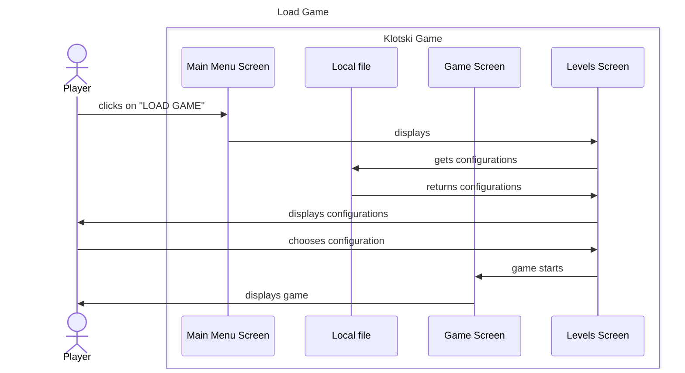

Internal sequence diagram
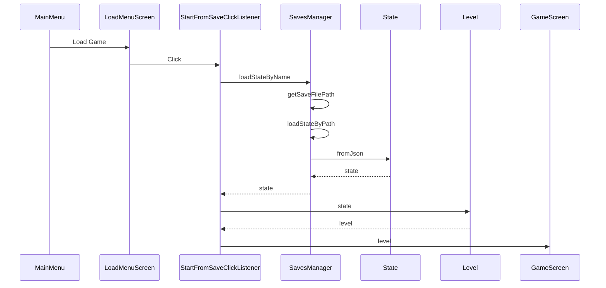

### Exit Game
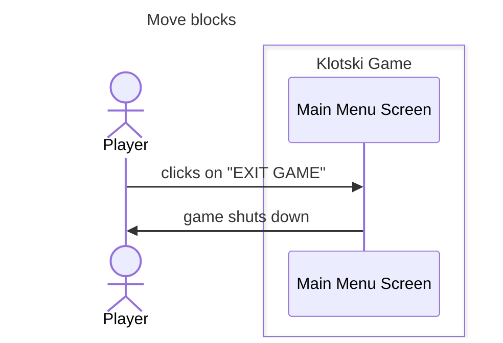

### Save game
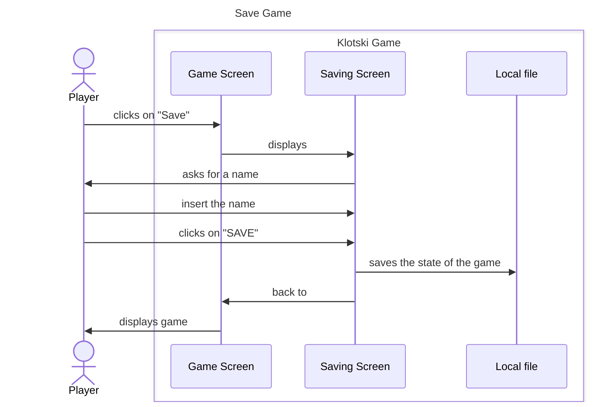

### Move blocks
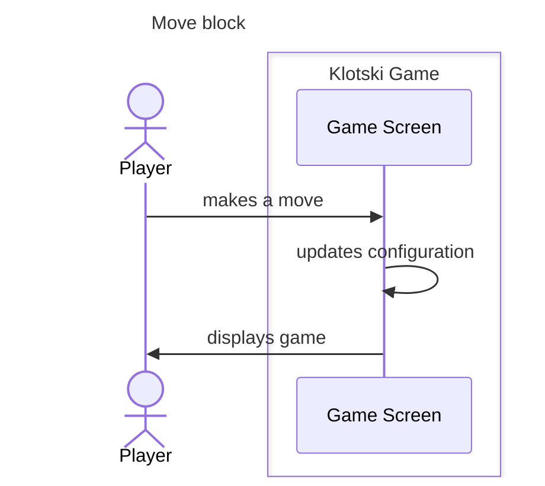

### Next best action
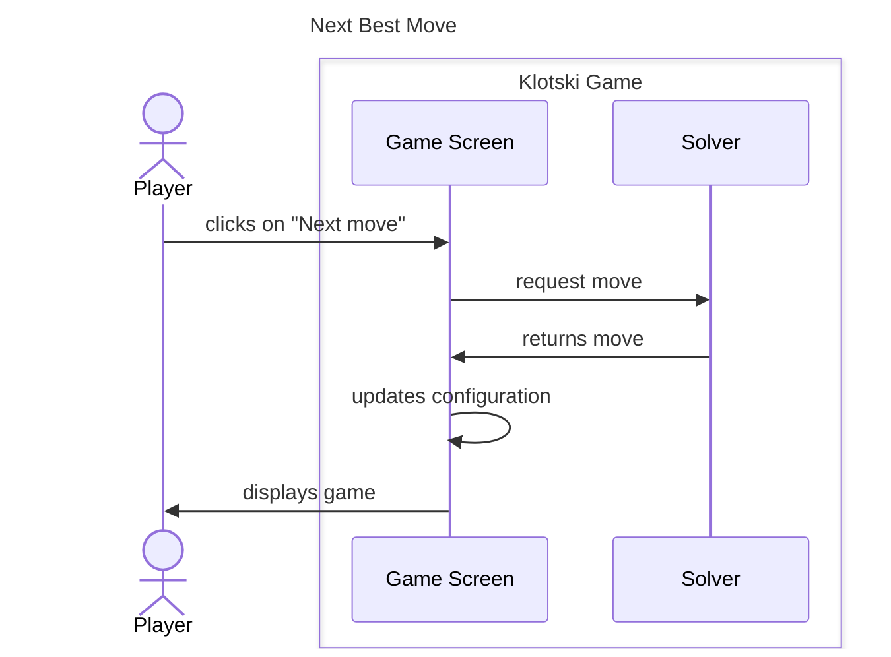

### Undo action
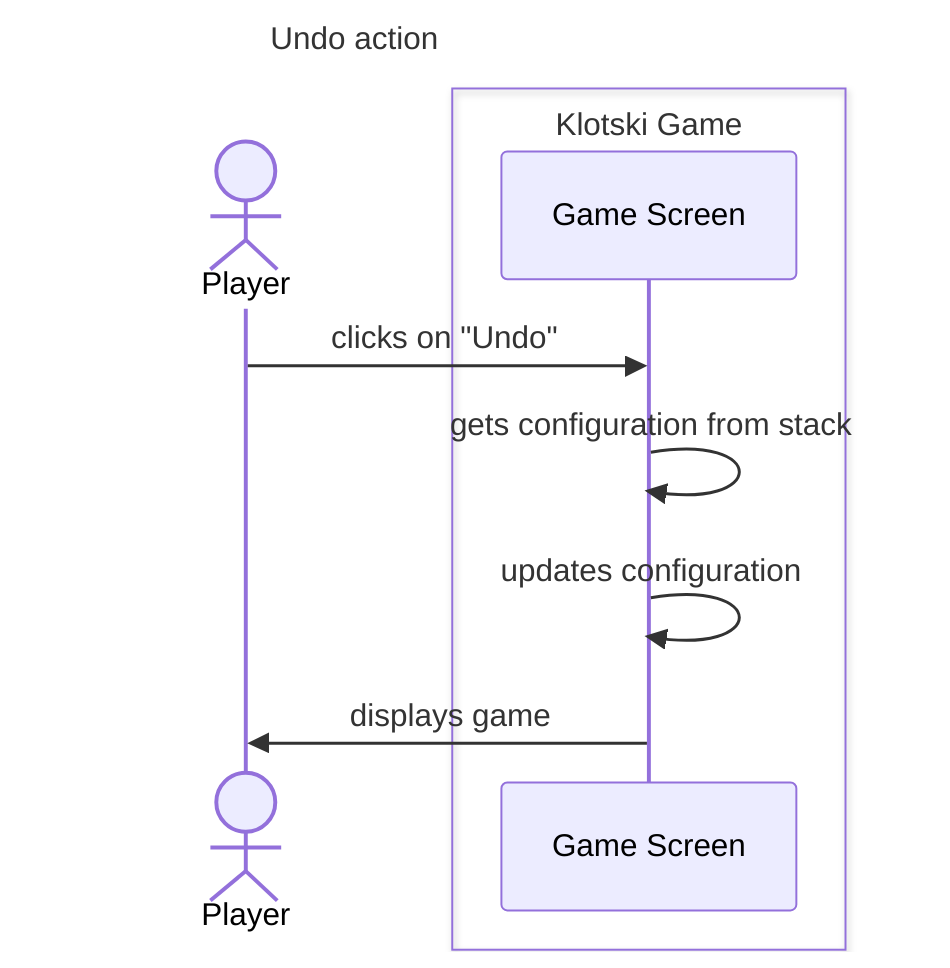

### Reset setup
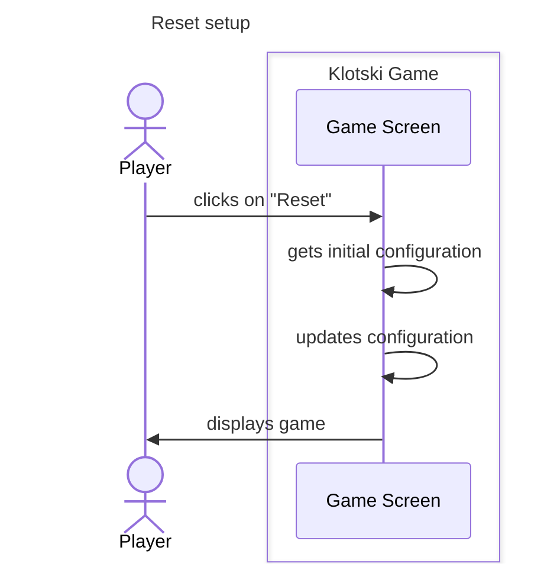

### Moves counter
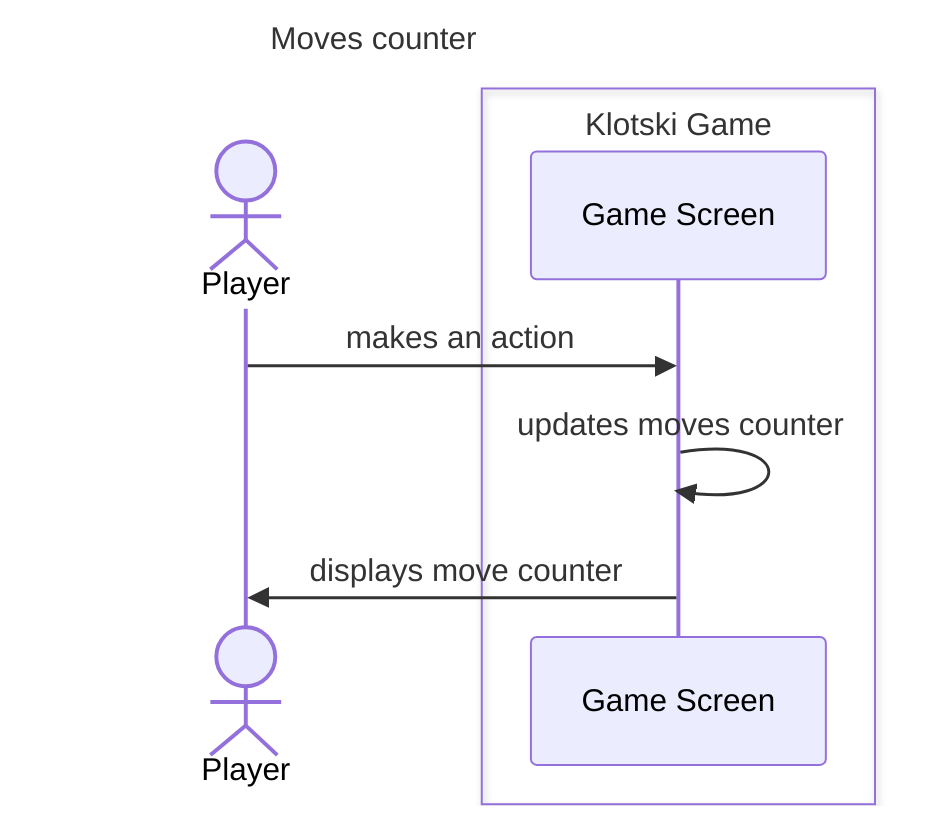

