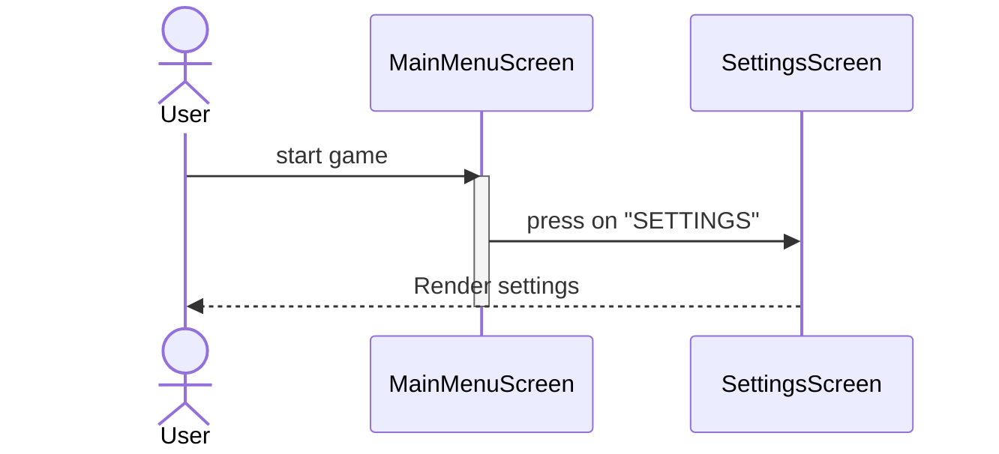
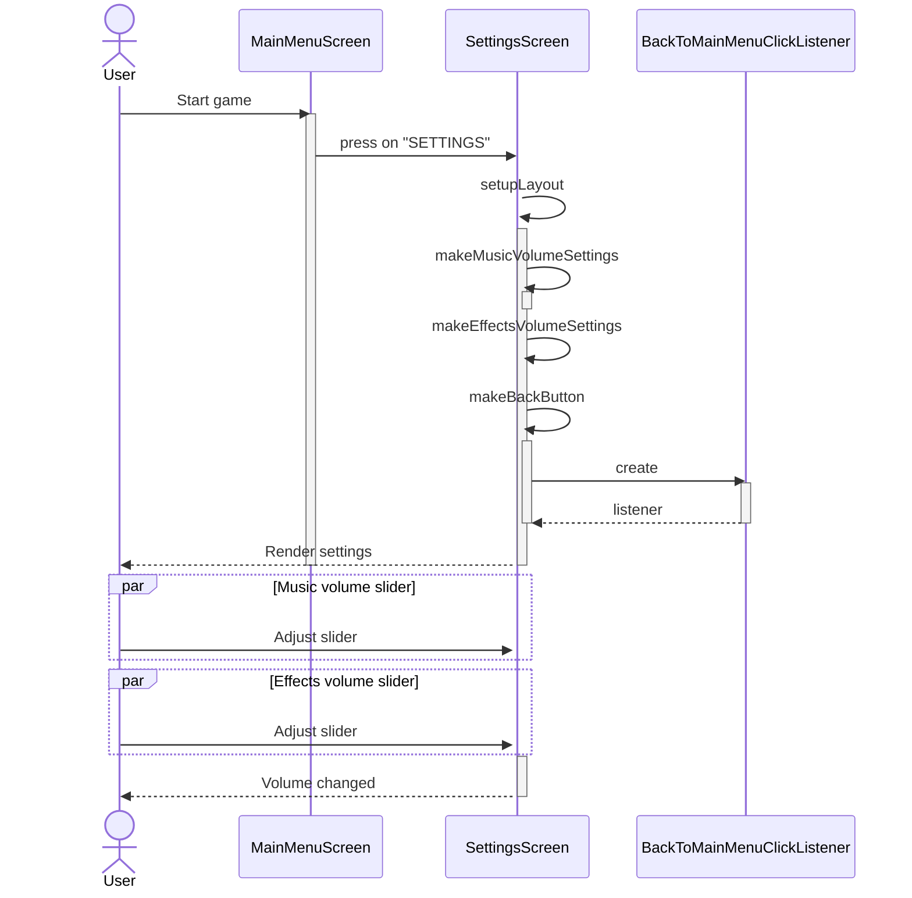
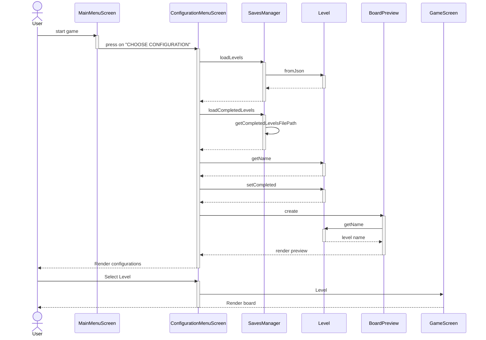

# System Sequence Diagram

[//]: # (Reference: https://mermaid.js.org/syntax/sequenceDiagram.html)

# Internal Sequence Diagram

### Game Settings


### Adjust Music/Effects Volume


### Select Starting Configuration


### New Game
```mermaid

```

### Load Game
```mermaid
sequenceDiagram
    actor User
    User ->> LoadMenuScreen : setupLayout
    activate LoadMenuScreen
    LoadMenuScreen ->> StartFromSaveClickListener : new
    activate StartFromSaveClickListener
    StartFromSaveClickListener ->> SavesManager : new
    activate SavesManager
    SavesManager -->> StartFromSaveClickListener : #32; 
    deactivate SavesManager
    StartFromSaveClickListener -->> LoadMenuScreen : #32; 
    deactivate StartFromSaveClickListener
    LoadMenuScreen ->> BackToMainMenuClickListener : new
    activate BackToMainMenuClickListener
    BackToMainMenuClickListener -->> LoadMenuScreen : #32; 
    deactivate BackToMainMenuClickListener
    deactivate LoadMenuScreen
```

### Exit Game
```mermaid
```

### Save Game
```mermaid
```

### Move Blocks
```mermaid
```

### Next Best Action
```mermaid
```

### Undo Action
```mermaid
```

### Reset setup
```mermaid
```


### Moves counter
```mermaid
```
