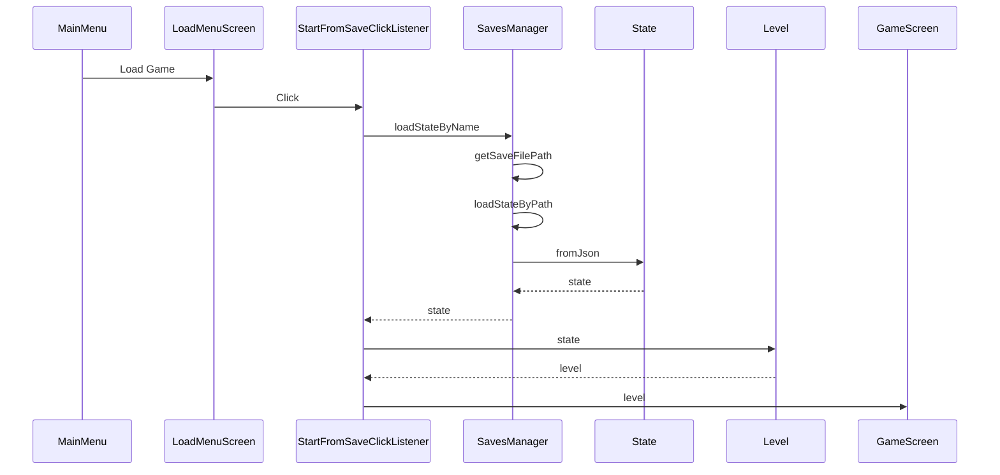

# System Sequence Diagram

[//]: # (Reference: https://mermaid.js.org/syntax/sequenceDiagram.html)

# Internal Sequence Diagram
### Load Game

```mermaid
sequenceDiagram
    participant MainMenu
    participant LoadMenuScreen
    participant StartFromSaveClickListener
    participant SavesManager
    
    MainMenu ->> LoadMenuScreen: Load Game
    LoadMenuScreen ->> StartFromSaveClickListener: Click
    StartFromSaveClickListener ->> SavesManager: loadStateByName
    SavesManager ->> SavesManager: getSaveFilePath
    SavesManager ->> SavesManager: loadStateByPath
    SavesManager ->> State: fromJson
    State -->> SavesManager: state
    
    SavesManager -->> StartFromSaveClickListener: state
    StartFromSaveClickListener ->> Level : state
    Level -->> StartFromSaveClickListener: level
    StartFromSaveClickListener ->> GameScreen: level

```
