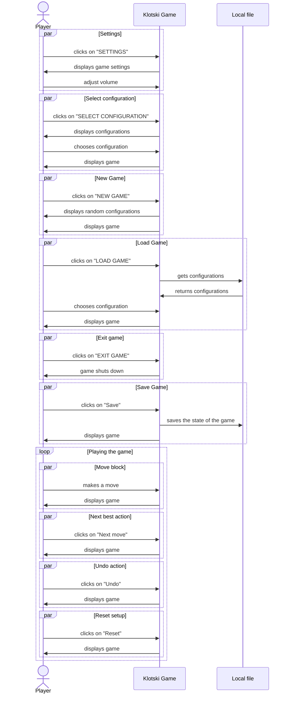
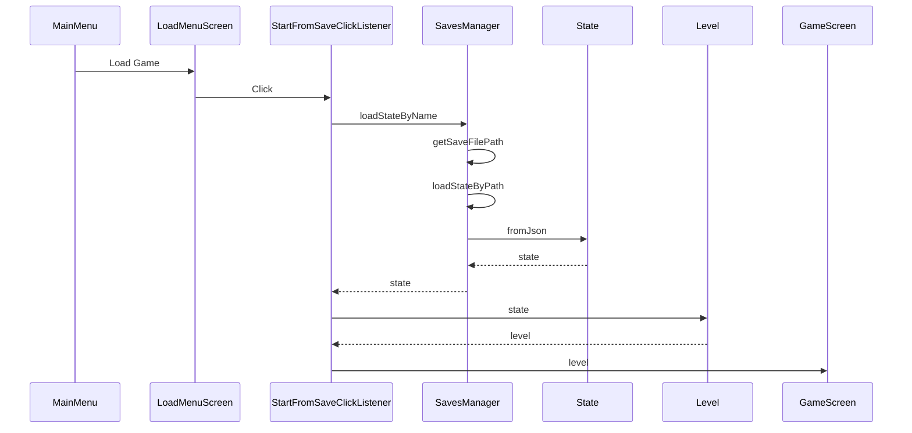

# System Sequence Diagram

```mermaid
sequenceDiagram
    actor Player
    Participant Klotski Game
    participant Local file


    par Settings
        Player ->> Klotski Game: clicks on "SETTINGS"
        Klotski Game ->> Player: displays game settings
        Player ->> Klotski Game: adjust volume
    end


    par Select configuration
        Player ->> Klotski Game: clicks on "SELECT CONFIGURATION"
        Klotski Game ->> Player: displays configurations
        Player ->> Klotski Game: chooses configuration
        Klotski Game ->> Player: displays game
    end


    par New Game
        Player ->> Klotski Game: clicks on "NEW GAME"
        Klotski Game ->> Player: displays random configurations
        Klotski Game ->> Player: displays game
    end


    par Load Game
        Player ->> Klotski Game: clicks on "LOAD GAME"
        Klotski Game ->> Local file: gets configurations
        Local file ->>  Klotski Game: returns configurations
        Player ->>  Klotski Game: chooses configuration
        Klotski Game ->> Player: displays game
    end
    

    par Exit game
        Player ->> Klotski Game: clicks on "EXIT GAME"
        Klotski Game ->> Player: game shuts down
    end


    par Save Game
        Player ->> Klotski Game: clicks on "Save"
        Klotski Game ->> Local file: saves the state of the game
        Klotski Game ->> Player : displays game
    end


    loop Playing the game
        par Move block
            Player ->> Klotski Game: makes a move
            Klotski Game ->> Player: displays game
        end

        par Next best action
            Player ->> Klotski Game: clicks on "Next move"
            Klotski Game ->> Player: displays game
        end

        par Undo action
            Player ->> Klotski Game: clicks on "Undo"
            Klotski Game ->> Player: displays game
                
        end

        par Reset setup
            Player ->> Klotski Game: clicks on "Reset"
            Klotski Game ->> Player: displays game
        end
    end
```

# Internal sequence diagram

```mermaid
sequenceDiagram
    participant MainMenu
    participant LoadMenuScreen
    participant StartFromSaveClickListener
    participant SavesManager
    
    MainMenu ->> LoadMenuScreen: Load Game
    LoadMenuScreen ->> StartFromSaveClickListener: Click
    StartFromSaveClickListener ->> SavesManager: loadStateByName
    SavesManager ->> SavesManager: getSaveFilePath
    SavesManager ->> SavesManager: loadStateByPath
    SavesManager ->> State: fromJson
    State -->> SavesManager: state
    
    SavesManager -->> StartFromSaveClickListener: state
    StartFromSaveClickListener ->> Level : state
    Level -->> StartFromSaveClickListener: level
    StartFromSaveClickListener ->> GameScreen: level
```

