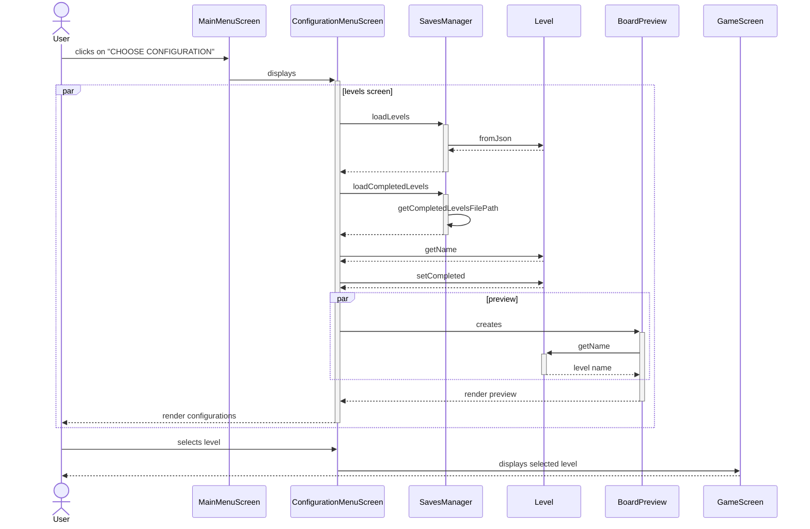
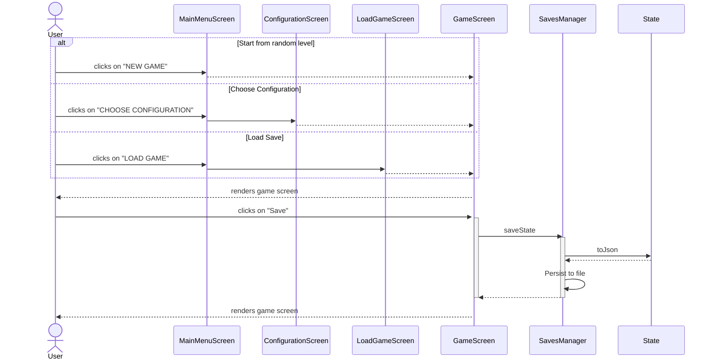
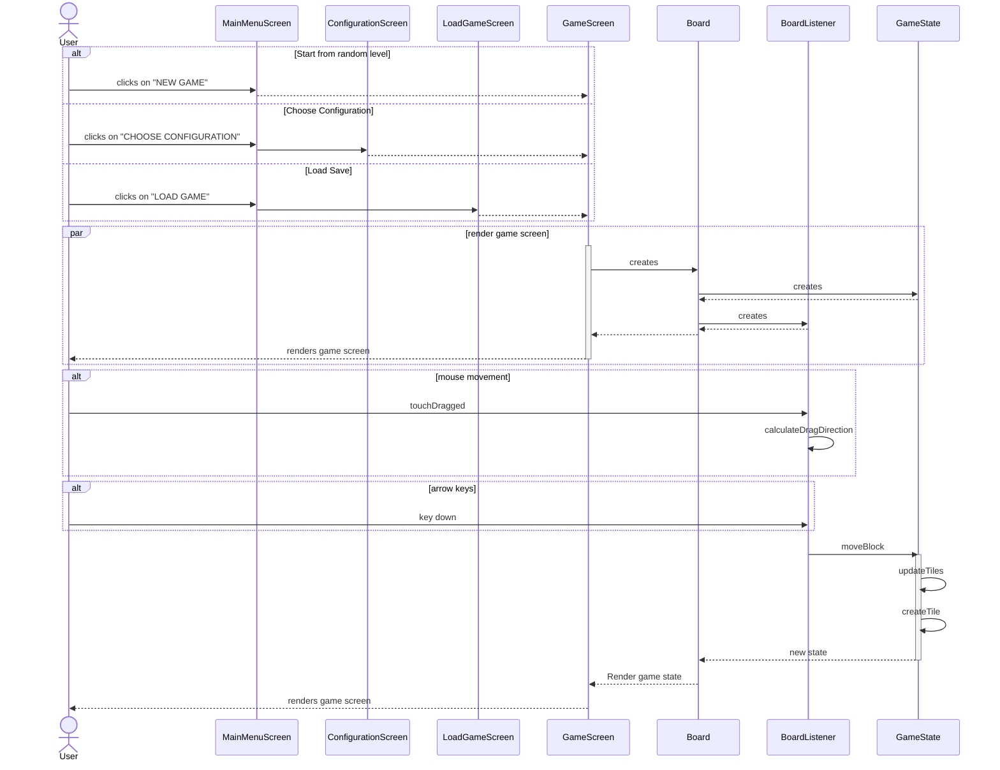
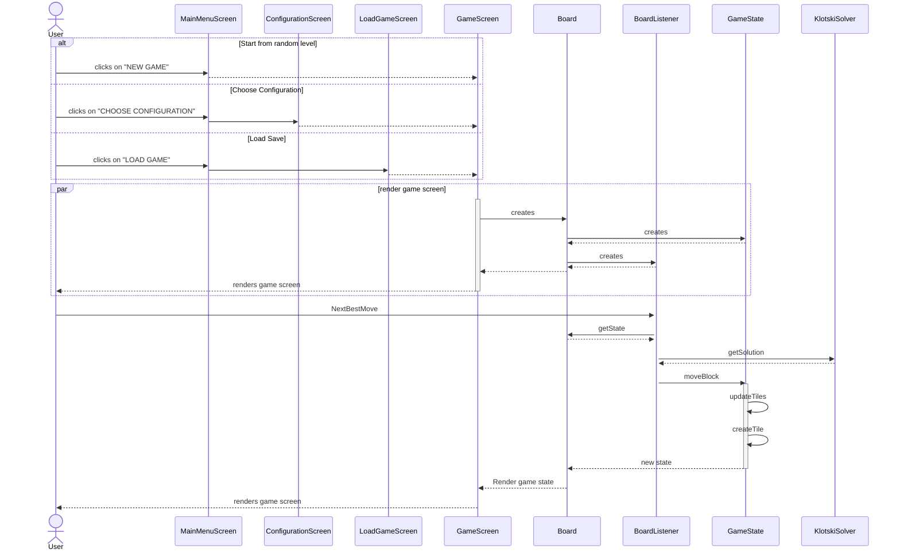
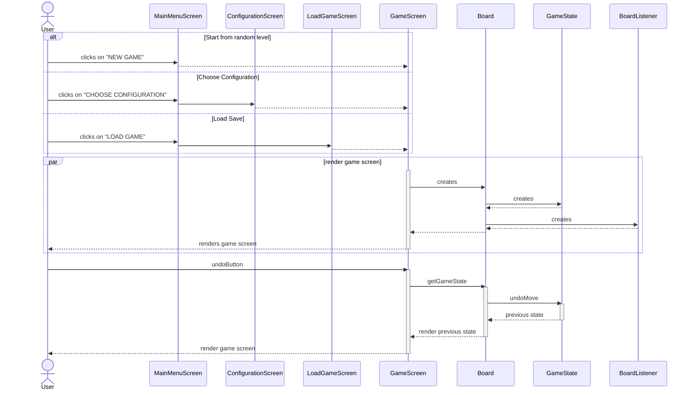
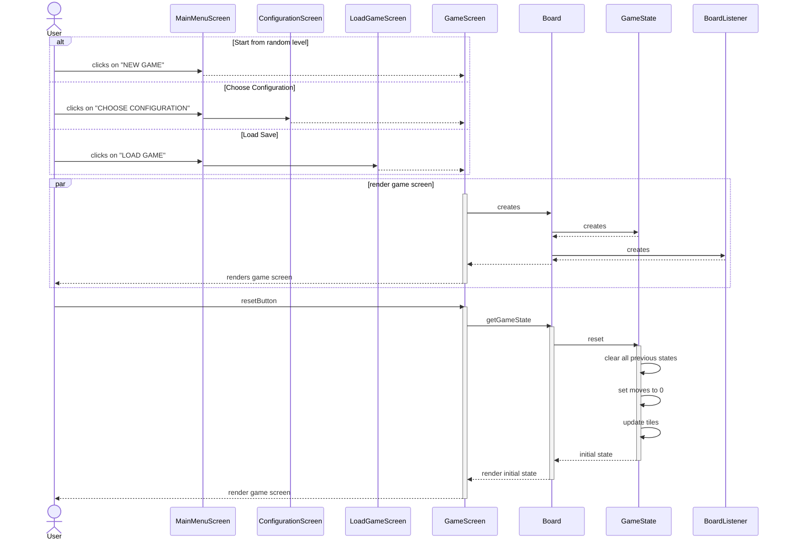
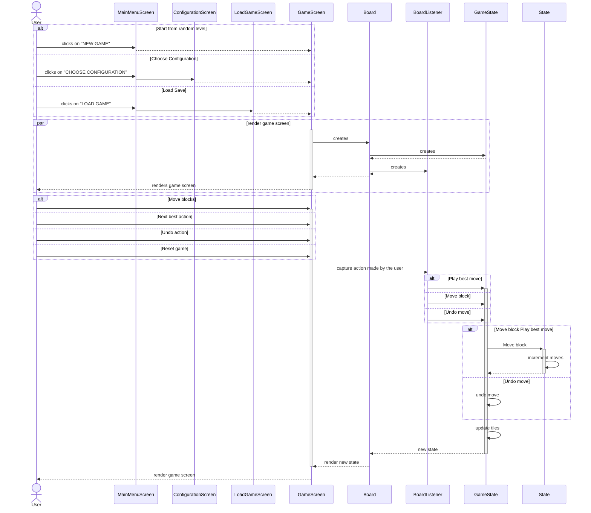

# System Sequence Diagram

# Internal Sequence Diagram

## Tutorial

## Game Settings

## Adjust Music/Effects Volume

## Select Configuration

## New Game

### Load Game

### Exit Game

## Save Game

## Move Blocks

## Next Best Action

## Undo Action

## Reset game

## Moves Counter

